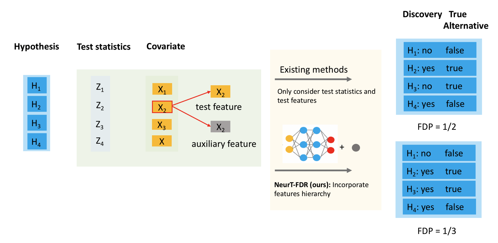

# NeurT-FDR

This library contains code for NeurT-FDR, a method for controlling false discovery rate by incorporating feature hierarchy. 

More details about our method can be found in the following arXiv paper: [https://arxiv.org/abs/2101.09809](https://arxiv.org/abs/2101.09809).

## Authors
- Lin Qiu
- Nils Murrugarra-Llerena
- Vítor Silva
- Lin Lin
- Vernon M. Chinchilli

## Overview

Controlling false discovery rate (FDR) while leveraging the side information of multiple hypothesis testing is an emerging research topic in modern data science. Existing methods rely on the test-level covariates while ignoring possible hierarchy among the covariates. This strategy may not be optimal for complex large-scale problems, where hierarchical information often exists among those test-level covariates. We propose NeurT-FDR which boosts statistical power and controls FDR for multiple hypothesis testing while leveraging the hierarchy among test-level covariates. Our method parametrizes the test-level covariates as a neural network and adjusts the feature hierarchy through a regression framework, which enables flexible handling of high-dimensional features as well as efficient end-to-end optimization. We show that NeurT-FDR has strong FDR guarantees and makes substantially more discoveries in synthetic and real datasets compared to competitive baselines.

[](neurt-fdr.png)

# Repository

The following files can be found in this repository:
 
(a) generate_simulated_data.ipynb: To generate the simulation data by different scenarios.

(b) run_methods_with_simulated_data.ipynb: Run methods on simulated data with BB-FDR, NeurT-FDRa, and NeurT-FDRb.

(c) simulation_analysis.py: Run all the methods on simulated data with FDR = 0.05, 0.1, 0.15, 0.2

(d) normix.py: Functions for predictive recursion to empirical estimate the null and alternative distribution

(e) two_groups_beta.py: The two-groups models including: BB-FDR, NeurT-FDRa, NeurT-FDRb.

(f) posterior_crt.py: Conditional randomization test (CRT) implementation.

# Getting started

In this repository, it is only necessary to run the Jupyter notebooks since they are able to invoke the Python scripts automatically. Thus, Python source code files correspond to encapsulated functions and/or classes that our notebooks depend on.

The two Jupyter notebooks are used to (i) generate the simulated dataset (i.e., `generate_simulated_data.ipynb`) and (ii) run experiments (i.e., `run_methods_with_simulated_data.ipynb`) as reported in our [arXiv](https://arxiv.org/abs/2101.09809) and ICML 2021 papers. 

# Requirements

- Python 3.7.8
- NumPy
- SciPy
- Pandas
- Scikit-learn
- Matplotlib
- Seaborn
- PyTorch
- [AdaFDR](https://pypi.org/project/adafdr/)

# Python environment configuration

Please run the following command line to configure your Python environment:

```bash
pip install requirements.txt
```

# Performance 

The default configuration of these notebooks takes several hours to run our approach in a machine with 16 CPUs and 64GB of RAM memory.

To run it in a feasible time, please consider to update the following variables in the file `simulation_analysis.py`:
- `alpha_list`: list of alpha values.
- `num_folds`: number of folds.
- `num_epochs`: number of epochs.

# Contact

Any questions please use one of the following contacts: 
- Lin Qiu, lq666988@gmail.com
- [Vítor Sousa](https://scholar.google.com/citations?user=5e92FUsAAAAJ&hl=en), vsilvasousa@snap.com
- [Nils Murrugarra-Llerena](https://scholar.google.com/citations?user=TNTgAPQAAAAJ&hl=en), nmurrugarraller@snap.com

# License

Copyright Snap Inc. 2021. This sample code is made available by Snap Inc. for informational purposes only. No license, whether implied or otherwise, is granted in or to such code (including any rights to copy, modify, publish, distribute and/or commercialize such code), unless you have entered into a separate agreement for such rights. Such code is provided as-is, without warranty of any kind, express or implied, including any warranties of merchantability, title, fitness for a particular purpose, non-infringement, or that such code is free of defects, errors or viruses. In no event will Snap Inc. be liable for any damages or losses of any kind arising from the sample code or your use thereof.